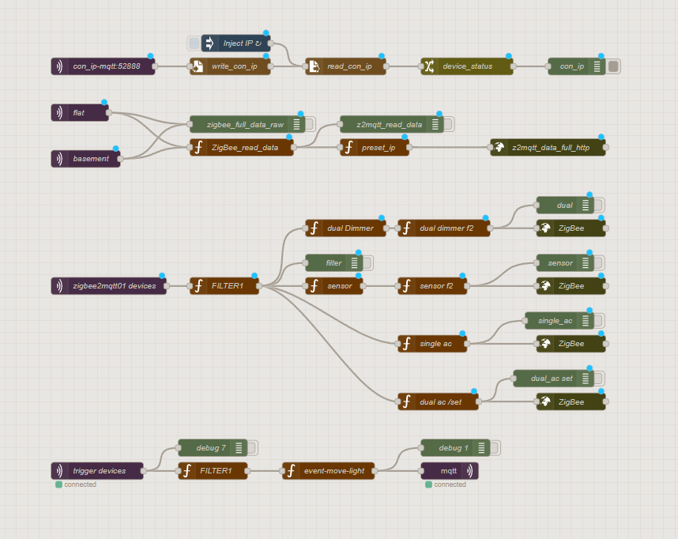
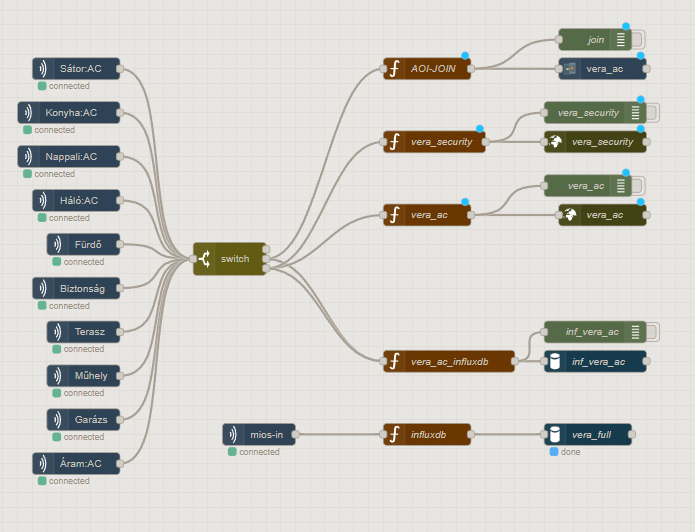

### Tasker Repostory

# Node-RED Flow: MIOS 2 HTTP
This Node-RED flow processes status updates MIOS via HTTP and translates them into custom HTTP GET requests for a connected home automation system. It also handles initial IP configuration and includes a simple motion-based lighting automation.

### Node-RED Setup

  

#  Node-RED Flow: Zigbee2Mqtt 2 HTTP
This Node-RED flow processes status updates from Zigbee2MQTT (Z2M) via MQTT and translates them into custom HTTP GET requests for a connected home automation system. It also handles initial IP configuration and includes a simple motion-based lighting automation.

  

