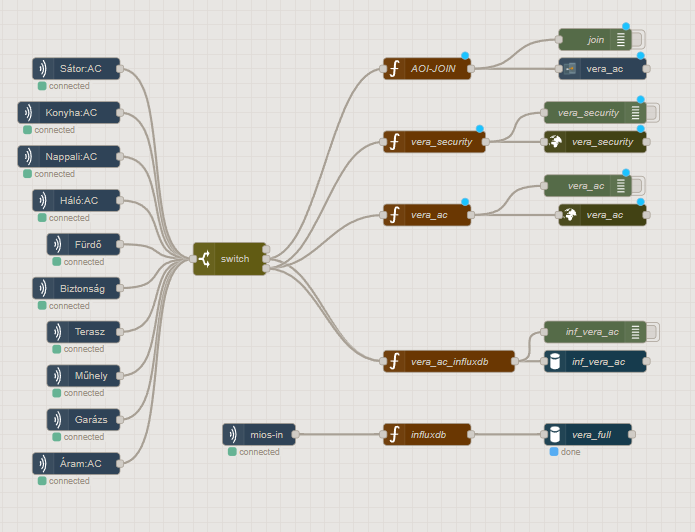

# **Node-RED Flow: MIOS to HTTP **

## **Overview**
This flow integrates multiple home automation systems including:
- **Vera** home controller (via MIOS protocol)
- **MQTT** messaging
- **InfluxDB** time-series database
- **HTTP APIs** for status report and device control
- **Join** notification service


### Node-RED Setup
<div style="display: flex; gap: 20px;">
  
</div>

### Node-RED Plugins
<div style="display: flex; gap: 20px;">
  
  
</div>


## **Key Functional Areas**

### **1. IP Address Management**
- **MQTT Input**: Receives connection IPs via `con_ip` topic
- **File Storage**: Persists IPs to `srv/con_ip` for recovery
- **Flow Variable**: Sets `con_ip` as a flow variable for dynamic routing
- **IP Validation**: Checks against patterns (192.168.x.x, 10.x.x.x)

### **2. Device State Processing**
#### **Input Sources:**
- **MIOS Input Nodes**: Monitor 8+ device categories:
  - Rooms (Nappali, Konyha, Fürdő)
  - Climate (Háló, Terasz)
  - Security (Biztonság)
  - Energy Monitoring (Áram)
  - Workshop/Garage (Műhely, Garázs)

#### **Processing Logic:**
- **Topic Parsing**: Splits `room:device:parameter` structure
- **Type Conversion**:
  - Boolean → Numeric (true=1, false=0)
  - String → Float for sensor values
- **Filtering**:
  - Only processes allowed parameters (`Status`, `LoadLevelStatus`, `Tripped`)
  - Validates against room whitelist

### **3. Output Routing**
#### **A. HTTP Control Path**
- **Dynamic URL Generation**: Uses flow-stored IP + port (1900/1901)
- **Target Systems**:
  - `vera_ac`: AC device control (port 1900)
  - `vera_security`: Security devices (port 1901)
- **Payload Structure**:

  ```json
  {
    "room": "Konyha",
    "avdevicename": "ACK_FaliLámpa",
    "avnewstatus": 75,
    "type": "LoadLevelStatus"
  }
  ```

#### **B. InfluxDB Logging**
- **Two Data Paths**:
  1. `vera_ac`: Focused AC/lighting data
  2. `vera_full`: Comprehensive sensor logging
- **Data Enhancement**:
  - Adds metadata (room, device type)
  - Converts units (boolean→numeric)
  - Timestamps all entries
- **Storage Bucket**: `veradata` 

#### **C. Join Notifications**
- **Message Format**:
  ```
  vera up=:=room=:=device=:=state
  ```
- **Filtering**: Only forwards status changes

### **4. System Monitoring**
- **Vera Data Polling**:
  - HTTP request to `http://192.168.4.10:3480/data_request`
  - Processes full system state (devices, rooms, scenes)
- **Output Channels**:
  - File dump (`vera_full.txt`)
  - HTTP forwarding (port 1904)
  - Debug console

---

## **Technical Architecture**


## Prerequisites

*   **Node-RED:** Installed and running.
*   **Custom Nodes:**
    *   `node-red-contrib-mios`: For reading data from the Vera/MIOS controller.
    *   `node-red-contrib-stackhero-influxdb-v2`: For writing data to InfluxDB V2.
    *   `node-red-contrib-join-joaoapps`: (Used in the flow, although the output wire is not connected, the node is present).
*   **Vera/MIOS Controller:** Must be accessible on the network. The flow is configured for the `mios-server` named `gtlvera1` (IP `192.168.4.10`).
